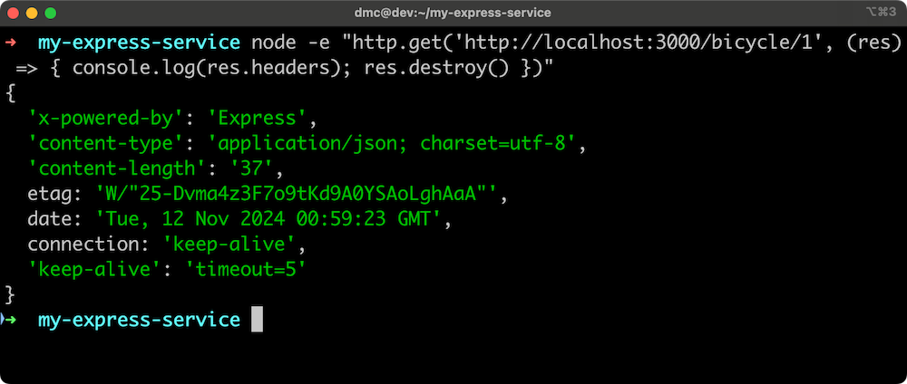

<h1>Implementación de un GET RESTful JSON con Express (1)</h1>

Para fines de comparación, vamos a reimplementar de forma concisa nuestra ruta GET RESTful JSON utilizando Express.

<h2>Requisitos de la Ruta GET</h2>
<ul>
  <li>Responde con una carga útil JSON válida</li>
  <li>Responde con un encabezado <code>Content-Type</code> de <code>application/json</code></li>
  <li>Responde con un código de estado <strong>200</strong> cuando es exitoso</li>
  <li>Responde con un código de estado <strong>404</strong> cuando el recurso solicitado no está disponible (cuando <code>read</code> responde con el mensaje <code>'not found'</code>)</li>
  <li>Responde con código <strong>400</strong>, <strong>404</strong> o <strong>405</strong> para métodos no soportados (por ejemplo, un <code>POST</code> a esta ruta)</li>
  <li>Responde con un código de estado <strong>500</strong> para errores desconocidos</li>
</ul>

<h2>Generar el Proyecto Express</h2>

<pre><code>npm install -g express-generator
express my-express-service
cd my-express-service
npm install
</code></pre>

<h2>Crear los Archivos Necesarios</h2>

<pre><code>node -e "fs.openSync('model.js', 'w')"
cd routes
node -e "fs.openSync('bicycle.js', 'w')"
cd ..
</code></pre>

<h3>Contenido de <code>model.js</code></h3>

<pre><code>'use strict'

module.exports = {
  bicycle: bicycleModel()
}

function bicycleModel () {
  const db = {
    1: { brand: 'Veloretti', color: 'green' },
    2: { brand: 'Batavus', color: 'yellow' }
  }

  return {
    read
  }

  function read (id, cb) {
    if (!(db.hasOwnProperty(id))) {
      const err = Error('not found')
      setImmediate(() => cb(err))
      return
    }
    setImmediate(() => cb(null, db[id]))
  }
}
</code></pre>

<h3>Contenido de <code>routes/bicycle.js</code></h3>

<pre><code>var express = require('express');
var router = express.Router();
var model = require('../model');

router.get('/:id', function(req, res, next) {
  model.bicycle.read(req.params.id, (err, result) => {
    if (err) {
      if (err.message === 'not found') next();
      else next(err);
    } else {
      res.send(result);
    }
  });
});

module.exports = router;
</code></pre>

<h2>Modificar <code>app.js</code></h2>

En la línea 9 aproximadamente:

<pre><code>var bicycleRouter = require('./routes/bicycle');
</code></pre>

Y alrededor de la línea 25, justo antes del manejo de errores:

<pre><code>app.use('/bicycle', bicycleRouter);
</code></pre>

<h2>Probar el Servicio</h2>

<pre><code>npm start
</code></pre>

Visita <a href="http://localhost:3000/bicycle/1">http://localhost:3000/bicycle/1</a> y deberías ver:

<pre><code>{"brand":"Veloretti","color":"green"}</code></pre>

<h3>Inspeccionar Encabezados</h3>

<pre><code>node -e "http.get('http://localhost:3000/bicycle/1', (res) => { console.log(res.headers); res.resume() })"
</code></pre>

Resultado esperado:

<h2>Nota</h2>

Antes de Node v22, el encabezado <code>connection</code> por defecto era <code>close</code>. Desde Node v22, es <code>keep-alive</code> para permitir la reutilización de conexiones. Express respeta los encabezados predeterminados del módulo <code>http(s)</code> de Node. Por eso se usa <code>res.resume()</code>, que "reanuda" el stream para permitir que se cierre correctamente.

Express detecta que el contenido de la respuesta es un objeto y automáticamente configura el encabezado <code>Content-Type</code> a <code>application/json; charset=utf-8</code>.

 
 
 
 
 
 
 
 
 
 
 
 
 
 

<h1>Implementación de un GET RESTful JSON con Express (2)</h1>

El siguiente comando puede usarse para verificar una respuesta <strong>200 OK</strong>:

<pre><code>node -e "http.get('http://localhost:3000/bicycle/1', (res) => { console.log(res.headers); res.resume() })"
</code></pre>

Esto debería mostrar: <strong>200</strong>.

También podemos verificar una respuesta <strong>404</strong> usando el mismo comando pero con un ID que no existe:

<pre><code>node -e "http.get('http://localhost:3000/bicycle/9', (res) => { console.log(res.headers); res.resume() })"
</code></pre>

Esto debería mostrar: <strong>404</strong>.  
En este caso, la función <code>read</code> de <code>model.js</code> respondió con un error con el mensaje <code>'not found'</code> y la función <code>next</code> en el manejador de rutas fue llamada sin escribir nada en la respuesta. Esto hace que Express pase al siguiente middleware en <code>app.js</code>, que es:

<pre><code>app.use(function(req, res, next) {
  next(createError(404));
});
</code></pre>

Cuando una ruta llama a <code>next()</code> sin un error, este pequeño middleware genera un error 404.  
Como este middleware pasa el error a su propio <code>next</code>, esto llega al middleware de manejo de errores en <code>app.js</code>, que se ve así:

<pre><code>app.use(function(err, req, res, next) {
  // asignar variables locales, solo muestra detalles en desarrollo
  res.locals.message = err.message;
  res.locals.error = req.app.get('env') === 'development' ? err : {};

  // renderiza la página de error
  res.status(err.status || 500);
  res.render('error');
});
</code></pre>

Aunque cumple con el criterio de devolver un código 404, este middleware de errores <strong>no devuelve JSON</strong>, sino <strong>HTML</strong>.  
Podemos ver ese HTML directamente en el navegador visitando:  
<a href="http://localhost:3000/bicycle/9">http://localhost:3000/bicycle/9</a>

<h2>Cambiar la respuesta de error a JSON</h2>

Express, por defecto, sirve HTML (ya que originalmente fue diseñado para generar contenido dinámico).  
Sin embargo, podemos modificar el middleware de errores para que devuelva una respuesta en JSON:

<pre><code>app.use(function(err, req, res) {
  res.status(err.status || 500);
  res.send({
    type: 'error',
    status: err.status,
    message: err.message,
    stack: req.app.get('env') === 'development' ? err.stack : undefined
  });
});
</code></pre>

Luego de reiniciar el servidor y navegar a <a href="http://localhost:3000/bicycle/9">http://localhost:3000/bicycle/9</a>, obtendrás una respuesta como esta:

<pre><code>{
  "type": "error",
  "status": 404,
  "message": "Not Found"
}
</code></pre>

<h2>Probar con un POST a una ruta GET válida</h2>

Probemos enviar una solicitud POST a la ruta <code>/bicycle/1</code>:

<pre><code>node -e "http.request('http://localhost:3000/bicycle/1', { method: 'post', headers: { connection: 'close' }}, (res) => console.log(res.statusCode)).end()"
</code></pre>

Express, por defecto, también responde con un <strong>404</strong> en este escenario. Por lo tanto, el resultado será:

<pre><code>404
</code></pre>

<h2>Simular un error desconocido (500)</h2>

Modifica temporalmente la función <code>read</code> en <code>model.js</code> para que siempre falle:

<pre><code>function read (id, cb) {
  setImmediate(() => cb(Error()))
}
</code></pre>

Reinicia el servidor (<code>Ctrl + C</code> y luego <code>npm start</code>), y en otra terminal ejecuta:

<pre><code>node -e "http.get('http://localhost:3000/bicycle/1', (res) => { console.log(res.statusCode); res.resume() })"
</code></pre>

Como ahora hay un error que no está relacionado con el ID, el resultado será:

<pre><code>500
</code></pre>

<h2>Resumen: Criterios para la ruta GET</h2>

<ul>
  <li>✅ Responder con un payload JSON válido</li>
  <li>✅ Incluir el encabezado <code>Content-Type: application/json</code></li>
  <li>✅ Responder con <strong>200</strong> cuando sea exitoso</li>
  <li>✅ Responder con <strong>404</strong> cuando el recurso no exista (<code>'not found'</code>)</li>
  <li>✅ Responder con <strong>400</strong>, <strong>404</strong> o <strong>405</strong> para métodos no soportados</li>
  <li>✅ Responder con <strong>500</strong> para errores desconocidos</li>
</ul>

Ahora hemos verificado que nuestra implementación cumple <strong>con todos los criterios</strong> definidos para nuestra ruta GET RESTful en JSON.

 
 
 
 
 
 

# Lab 5.1 - Implement a RESTful JSON GET

Consejos y Buenas Prácticas para el Laboratorio

Al trabajar en los ejercicios del laboratorio, ten en cuenta lo siguiente:

- Al acceder a URLs externas que están incrustadas en el documento PDF que se encuentra más abajo, siempre utiliza clic derecho y abre en una nueva pestaña o ventana. Intentar abrir la URL haciendo clic directamente sobre ella cerrará la ventana o pestaña de tu curso.

- Dependiendo del visor de PDF que uses, si copias y pegas texto desde el documento, podrías perder el formato original. Por ejemplo, los guiones bajos podrían desaparecer y ser reemplazados por espacios. Por ello, puede ser necesario que edites el texto manualmente. Siempre verifica que el texto pegado sea correcto.

[Ver PDF aquí](./assets/lab5.1.pdf)