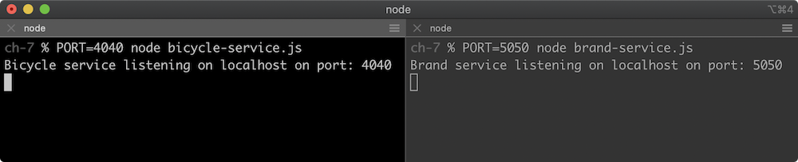
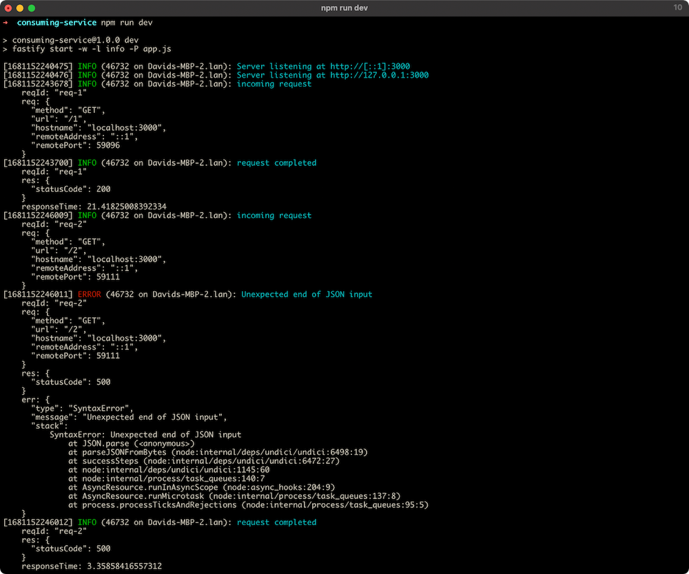

# Visión general y objetivos del capítulo

Un caso común para los servicios en Node.js, y los servicios RESTful en general, es proporcionar un rol de mediación, a veces conocido como el “frente del backend”. Estos son servicios que se ubican entre las solicitudes del cliente —especialmente desde un cliente en el navegador— y las API de backend, que pueden ser SOAP, RPC, bases de datos o incluso otras APIs basadas en REST.

En este capítulo implementaremos un servicio que consume y agrega datos desde otros servicios HTTP. Aunque los ejemplos estarán basados en Fastify, los conceptos y enfoques pueden aplicarse a cualquier framework.

<h3>Convención y Descubrimiento de Servicios</h3>

Cómo un servicio descubre a otro es un tema amplio, que va desde el uso de direcciones IP personalizadas, mallas de servicios con descubrimiento DNS y nombres de dominio, hasta soluciones que incorporan tablas hash distribuidas (DHT). Hay muchas formas en que un servicio puede descubrir a otro.

En la mayoría de los casos, contar con una infraestructura de despliegue que pueda inyectar valores en el proceso en tiempo de ejecución permite cierto grado de flexibilidad y capacidad de reconfiguración.

Un ejemplo simple sería cuando los servicios son referenciados mediante una URL que se inyecta como una <strong>variable de entorno</strong>.

Por ejemplo, si existieran un servicio de <strong>Bicicletas</strong> y uno de <strong>Botes</strong>, y otro servicio necesitara comunicarse con ellos, podría determinar la URL base de cada uno así:

<pre><code>const { BICYCLE_SERVICE, BOAT_SERVICE } = process.env;
</code></pre>

Entonces podría hacer una solicitud a un endpoint de un servicio como este:

<pre><code>const http = require('http');
http.get(`${BICYCLE_SERVICE}/some/route`, (res) => {
  /* hacer algo */
});
</code></pre>

En el momento del despliegue, la infraestructura operacional podría configurar esas variables de entorno con las URLs apropiadas. Durante el desarrollo local, estas variables de entorno podrían ser URLs del tipo <code>http://localhost:[puerto]</code>, donde <code>[puerto]</code> es el puerto en el que se ha iniciado el servicio correspondiente.

Una variación de este patrón es inyectar solo el número de puerto del servicio, en lugar de la URL completa. En ese caso, las variables de entorno se usarían así:

<pre><code>const { BICYCLE_SERVICE_PORT, BOAT_SERVICE_PORT } = process.env;
const http = require('http');
const bicycleSrv = `http://localhost:${BICYCLE_SERVICE_PORT}`;
http.get(`${bicycleSrv}/some/route`, (res) => {
  /* hacer algo */
});
</code></pre>

El enfoque que se utilice depende completamente de las decisiones tomadas al desplegar la aplicación. Sin embargo, en este capítulo se usará la técnica de <strong>inyectar el número de puerto mediante variables de entorno</strong>, ya que es la convención utilizada en el examen de certificación.

 
 
 
 
 
 
 
 

<h2>Servicios Simulados (Mock Services)</h2>

Para nuestros propósitos, crearemos dos <strong>servicios simulados</strong> que podemos ejecutar localmente para tener con qué interactuar.

<h3>Servicio Simulado de Bicicletas</h3>

Nuestro <strong>primer servicio simulado</strong> entrega entidades de datos de bicicletas y se ve así:

<pre><code>
'use strict'
const http = require('http')
const url = require('url')
const colors = ['Yellow', 'Red', 'Orange', 'Green', 'Blue', 'Indigo']
const MISSING = 2

const server = http.createServer((req, res) => {
  const { pathname } = url.parse(req.url)
  let id = pathname.match(/^\/(\d+)$/)
  if (!id) {
    res.statusCode = 400
    return void res.end()
  }

  id = Number(id[1])

  if (id === MISSING) {
    res.statusCode = 404
    return void res.end()
  }

  res.setHeader('Content-Type', 'application/json')

  res.end(JSON.stringify({
    id: id,
    color: colors[id % colors.length]
  }))
})

server.listen(process.env.PORT || 0, () => {
  const { port } = server.address()
  console.log('Bicycle service listening on localhost on port: ' + port)
})
</code></pre>

Guarda esto como <code>bicycle-service.js</code>.

<h3>Servicio Simulado de Marcas</h3>

El <strong>segundo servicio</strong> entrega nombres de marcas y se ve así:

<pre><code>
'use strict'
const http = require('http')
const url = require('url')
const brands = ['Gazelle', 'Batavus', 'Azor', 'Cortina', 'Giant','Sparta']
const MISSING = 3

const server = http.createServer((req, res) => {
  const { pathname } = url.parse(req.url)
  let id = pathname.match(/^\/(\d+)$/)

  if (!id) {
    res.statusCode = 400
    return void res.end()
  }

  id = Number(id[1])

  if (id === MISSING) {
    res.statusCode = 404
    return void res.end()
  }

  res.setHeader('Content-Type', 'application/json')

  res.end(JSON.stringify({
    id: id,
    name: brands[id % brands.length]
  }))
})

server.listen(process.env.PORT || 0, () => {
  const { port } = server.address()
  console.log('Brand service listening on localhost on port: ' + port)
})
</code></pre>

Guarda esto como <code>brand-service.js</code>.

<h3>Notas</h3>

Esta <strong>no es la forma recomendada</strong> de crear servicios para producción. Utiliza un framework adecuado para eso.

El código anterior es solo una manera <strong>rápida y simple</strong> de correr múltiples servicios localmente y empezar a interactuar con ellos inmediatamente.

<h3>Iniciar los Servicios</h3>

En una terminal, inicia el servicio de bicicletas con el comando:

<pre><code>PORT=4040 node bicycle-service.js</code></pre>

En otra terminal, inicia el servicio de marcas con el comando:

<pre><code>PORT=5050 node brand-service.js</code></pre>

Deberías tener ahora dos terminales con procesos Node.js ejecutándose:

<ul>
  <li>Terminal 1 → Servicio de bicicletas en <code>localhost:4040</code></li>
  <li>Terminal 2 → Servicio de marcas en <code>localhost:5050</code></li>
</ul>

 

<h2>Navegación desde el navegador o cliente HTTP</h2>

Navegar en un navegador (o cualquier cliente HTTP) a <code>http://localhost:4040/1</code> debería proporcionar la siguiente respuesta:

<pre><code>{
  "id": 1,
  "color": "Red"
}
</code></pre>

Nota que la propiedad <code>id</code> funciona como un identificador de índice, ya que correlaciona los datos en cada servicio. La marca correspondiente a una bicicleta con ID 1 también tiene un ID de 1. Es importante reconocer que esta <strong>no es una buena arquitectura de datos</strong>: cada entidad de bicicleta tiene una relación uno a uno con cada entidad de marca. Es un enfoque simplificado para nuestros fines.

Navegar a <code>http://localhost:5050/5</code> debería proporcionar la siguiente respuesta:

<pre><code>{
  "id": 5,
  "name": "Sparta"
}
</code></pre>

<strong>¡Genial!</strong> Nuestros servicios simulados ya están configurados y funcionando. En la siguiente sección, crearemos un nuevo servicio y obtendremos datos desde uno de los servicios existentes.

Las secciones siguientes asumirán que los servicios aún están en ejecución y conectados a los puertos que especificamos en esta sección.

 
 
 

<h2>Obtención de datos</h2>

Node.js incluye funcionalidad para realizar solicitudes HTTP mediante el módulo <code>http</code> del núcleo (y solicitudes HTTPS con el módulo <code>https</code>).
Sin embargo, cuando se usan manejadores de rutas con <code>async/await</code>, los módulos del núcleo pueden volverse poco ergonómicos para hacer peticiones.

Existe una amplia variedad de bibliotecas para realizar solicitudes HTTP en el ecosistema de Node.js.
Desde Node v18, la API Web <code>fetch</code> está disponible como una función global en Node.
Aunque su estado es <strong>experimental</strong>, la API está implementada según la especificación, por lo que no cambiará,
y la implementación en Node-core usa <strong>Undici</strong>, un cliente HTTP enfocado en el rendimiento.

Para nuestros propósitos está bien usarla, pero ten en cuenta que el estado experimental implica posibles errores y problemas.
Para entornos de producción, hasta que <code>fetch</code> deje de ser experimental en Node, se recomienda usar
<a href="https://www.npmjs.com/package/node-fetch" target="_blank">node-fetch</a> o
<a href="https://www.npmjs.com/package/undici" target="_blank">undici</a>
(usar Undici permite actualizaciones más rápidas).
En este caso, usaremos la función <code>fetch</code> global integrada de Node disponible desde la versión 18 en adelante.

<h3>Configurando un nuevo servicio</h3>

<pre><code>node -e "fs.mkdirSync('consuming-service')"
cd consuming-service
npm init fastify
</code></pre>

Cuando termine el comando <code>npm init fastify</code> de generar el proyecto, instala las dependencias:

<pre><code>npm install</code></pre>

La carpeta <code>routes</code> generada por <code>npm init fastify</code> contiene un archivo <code>root.js</code> que configura la ruta raíz.
Actualmente se ve así:

<pre><code class="language-js">'use strict'

module.exports = async function (fastify, opts) {
  fastify.get('/', async function (request, reply) {
    return { root: true }
  })
}
</code></pre>

Vamos a adaptarlo para que acepte un parámetro en la URL (un ID), de modo que una solicitud GET pueda especificar un ID,
y luego lo use para obtener datos del servicio de bicicletas que configuramos en la sección anterior.

Actualiza el archivo <code>routes/root.js</code> con lo siguiente:

<pre><code class="language-js">'use strict'

const {
  BICYCLE_SERVICE_PORT = 4040
} = process.env

const bicycleSrv = `http://localhost:${BICYCLE_SERVICE_PORT}`

module.exports = async function (fastify, opts) {
  fastify.get('/:id', async function (request, reply) {
    const { id } = request.params
    const res = await fetch(`${bicycleSrv}/${id}`)
    const bicycle = res.json()
    return bicycle
  })
}
</code></pre>

En este caso, estamos asignando un puerto predeterminado a <code>BICYCLE_SERVICE_PORT</code>.
Esto puede sobrescribirse mediante una variable de entorno con ese nombre,
pero como hemos iniciado nuestro servicio de bicicletas en el puerto <code>4040</code>, no es necesario hacerlo aquí.

<h3>Iniciar el servicio consumidor</h3>

<pre><code>npm run dev</code></pre>

Si navegamos a <code>http://localhost:3000/1</code>, deberíamos ver la siguiente respuesta:

<pre><code>{
  "id": 1,
  "color": "Red"
}
</code></pre>

El hecho de que estemos devolviendo un objeto desde una función <code>async</code> (el manejador de ruta)
significa que Fastify también establecerá automáticamente el encabezado HTTP <code>Content-Type</code> como <code>application/json</code>.

Ahora ya estamos obteniendo datos desde uno de nuestros servicios y devolviéndolos como respuesta.
Hasta este punto simplemente estamos reenviando datos de un servicio a otro.
En la siguiente sección, combinaremos los datos de ambos servicios simulados y, en la última sección,
analizaremos cómo manejar errores, casos límite y problemas de disponibilidad.

 
 
 

<h2>Combinando Datos</h2>

Ya hicimos una solicitud a un servicio, ahora extendamos el archivo <code>routes/root.js</code> para hacer una solicitud al otro servicio y luego enviar ambos conjuntos de datos combinados en un objeto.

Modifica el contenido de <code>routes/root.js</code> de la siguiente forma:

<pre><code>'use strict'

const {
  BICYCLE_SERVICE_PORT = 4040, BRAND_SERVICE_PORT = 5050
} = process.env

const bicycleSrv = `http://localhost:${BICYCLE_SERVICE_PORT}`
const brandSrv = `http://localhost:${BRAND_SERVICE_PORT}`

module.exports = async function (fastify, opts) {
  fastify.get('/:id', async function (request, reply) {
    const { id } = request.params
    const bicycle = await (await fetch(`${bicycleSrv}/${id}`)).json()
    const brand = await (await fetch(`${brandSrv}/${id}`)).json()
    return {
      id: bicycle.id,
      color: bicycle.color,
      brand: brand.name,
    }
  })
}
</code></pre>

Ahora estamos haciendo una solicitud a ambos servicios y devolviendo un objeto que incluye datos de las respuestas de cada uno.

Si navegamos a <code>http://localhost:3000/1</code>, deberíamos obtener la siguiente respuesta:

<pre><code>{"id":1,"color":"Red","brand":"Batavus"}</code></pre>

Observa que cuando construimos el objeto que se devuelve, el valor de la propiedad <code>id</code> se toma del objeto <code>bicycle</code> en lugar de <code>request.params.id</code>. Esto es una buena práctica para evitar ataques XSS reflejados. Siempre que sea posible, evita devolver directamente los datos que el usuario envía al servicio. Consulta <a href="https://owasp.org/www-community/attacks/xss/">OWASP: Pruebas para XSS reflejado</a> para más información. Hablaremos más de seguridad en los capítulos 9 y 10.

Nota que hacemos primero una solicitud a un servicio, esperamos la respuesta, y luego hacemos la segunda. Esto es válido, pero en general es mejor hacer solicitudes concurrentes cuando sea posible.

En nuestro caso específico, podríamos hacer ambas solicitudes concurrentemente así:

<pre><code>'use strict'

const {
  BICYCLE_SERVICE_PORT = 4040, BRAND_SERVICE_PORT = 5050
} = process.env

const bicycleSrv = `http://localhost:${BICYCLE_SERVICE_PORT}`
const brandSrv = `http://localhost:${BRAND_SERVICE_PORT}`

module.exports = async function (fastify, opts) {
  fastify.get('/:id', async function (request, reply) {
    const { id } = request.params
    const noop = Function.prototype
    const signal = AbortSignal.timeout(3000)

    const bicycleReq = await fetch(`${bicycleSrv}/${id}`, { signal })
    const brandReq = await fetch(`${brandSrv}/${id}`, { signal })

    const bicycleJsonPromise = bicycleReq.json()
    const brandJsonPromise = brandReq.json()

    bicycleJsonPromise.catch(noop)
    brandJsonPromise.catch(noop)

    const results = await Promise.allSettled([bicycleJsonPromise, brandJsonPromise])

    for (const { reason } of results) if (reason) throw reason

    const [bicycle, brand] = results.map(({ value }) => value)

    return {
      id: bicycle.id,
      color: bicycle.color,
      brand: brand.name,
    }
  })
}
</code></pre>

El método <code>Promise.allSettled()</code> devuelve una promesa que se resuelve con un arreglo de objetos que representan el estado final de cada promesa. El ciclo <code>for...of</code> verifica si alguna promesa fue rechazada consultando la propiedad <code>reason</code>. Si hay error, se lanza.

Este enfoque es aceptable para nuestro caso. En una aplicación más grande podrías decidir si devolver datos parciales o fallar más temprano según la estrategia adecuada.

<code>AbortSignal.timeout</code> crea una señal que se auto-aborta después de 3 segundos. Se pasa en las opciones de <code>fetch</code> para limitar el tiempo de espera.

También usamos <code>catch(noop)</code> para evitar que Node.js lance advertencias (<code>PromiseHandledRejectionWarning</code>) porque el manejo del error se hace asincrónicamente con <code>Promise.allSettled</code>.

Hacer solicitudes concurrentes no siempre es posible, ya que puede haber dependencia entre los datos de los servicios.

Si navegamos nuevamente a <code>http://localhost:3000/1</code>, obtendremos el mismo resultado que en el caso secuencial:

<pre><code>{"id":1,"color":"Red","brand":"Batavus"}</code></pre>

Ahora hemos hecho exitosamente solicitudes a dos servicios <em>upstream</em> y respondido con los datos combinados de ambos.

 
 
 

<h2>Gestionando Códigos de Estado (1)</h2>

Hasta ahora hemos implementado el camino feliz para obtener y combinar datos. Pero hay casos que aún no hemos manejado. Por ejemplo:

<ul>
  <li>¿Qué hacemos si uno de los servicios responde con un código de estado 404?</li>
  <li>¿Qué pasa si uno de los servicios no está disponible?</li>
  <li>¿Qué pasa si cualquiera de los servicios responde con un código de estado que no sea 200?</li>
  <li>¿Y qué hay de otros códigos de error 4XX o 5XX?</li>
</ul>

Este es un conjunto limitado de preguntas, podríamos ir más lejos, pero es suficiente para comenzar. En esta sección vamos a asegurarnos de que cada uno de estos casos sea atendido en nuestra implementación.

Comencemos verificando el código de estado de una ruta que sabemos que funciona correctamente ejecutando el siguiente comando:

<pre><code>node -e "http.get('http://localhost:3000/1', (res) =&gt; { console.log(res.statusCode); res.resume()})"
</code></pre>

Esto debería mostrar: <strong>200</strong>.

Intentemos ahora con <code>2</code> como ID:

<pre><code>node -e "http.get('http://localhost:3000/2', (res) =&gt; { console.log(res.statusCode); res.resume()})"
</code></pre>

Esto mostrará: <strong>500</strong>. Esto significa que ocurrió un error en el manejador de la ruta y Fastify tomó el control respondiendo con un error 500 del servidor. Si iniciamos el servidor con <code>npm run dev</code>, este error se mostrará en la consola de forma similar a lo siguiente:

<h2>Gestionando Códigos de Estado (1)</h2>

Podemos ver que el error ocurrido es un <code>SyntaxError</code>. Esto es generado por la función <code>fetch</code> incorporada porque uno de los servicios upstream respondió con un código de estado <code>404</code> y terminó la solicitud con un cuerpo de respuesta vacío. Está intentando analizar JSON en un buffer vacío.

Pero nuestro servidor está recibiendo un <code>404</code> del servicio upstream y responde al cliente con un código de estado <code>500</code>. ¿Es ese el comportamiento que queremos? La respuesta depende mucho de la situación.

Podríamos reenviar el código <code>404</code>, podríamos manejar el caso del cuerpo vacío y básicamente ignorar los datos de ese servicio pero devolver los datos del otro. La respuesta sobre cómo manejar esto depende de los requisitos funcionales y no funcionales del contexto de negocio para el que se está implementando el servicio.

Manejaremos este escenario reenviando el <code>404</code>. En otras palabras, si cualquiera de los servicios upstream tiene un error <code>404</code>, enviaremos un <code>404</code> desde nuestro servicio.

<h3>routes/root.js</h3>

<pre><code>'use strict'

const {
  BICYCLE_SERVICE_PORT = 4040, BRAND_SERVICE_PORT = 5050
} = process.env

const bicycleSrv = `http://localhost:${BICYCLE_SERVICE_PORT}`
const brandSrv = `http://localhost:${BRAND_SERVICE_PORT}`

module.exports = async function (fastify, opts) {
  fastify.get('/:id', async function (request, reply) {
    const { id } = request.params
    const noop = Function.prototype
    const signal = AbortSignal.timeout(3000)

    const bicycleReq = await fetch(`${bicycleSrv}/${id}`, { signal })
    const brandReq = await fetch(`${brandSrv}/${id}`, { signal })

    if (bicycleReq.status === 404 || brandReq.status === 404) {
      throw fastify.httpErrors.notFound()
    }

    const bicycleJsonPromise = bicycleReq.json()
    const brandJsonPromise = brandReq.json()

    bicycleJsonPromise.catch(noop)
    brandJsonPromise.catch(noop)

    const results = await Promise.allSettled([bicycleJsonPromise, brandJsonPromise])

    for (const { reason } of results) {
      if (reason) throw reason
    }

    const [bicycle, brand] = results.map(({ value }) => value)

    return {
      id: bicycle.id,
      color: bicycle.color,
      brand: brand.name,
    }
  })
}
</code></pre>

Si la propiedad <code>status</code> de cualquiera de las solicitudes es <code>404</code>, entonces lanzamos <code>fastify.httpErrors.notFound()</code> (proporcionado por <code>@fastify/sensible</code>, incluido en el boilerplate de <code>npm init fastify</code>).

Cualquier otro error será lanzado y manejado por Fastify como de costumbre, por lo que si un servicio upstream responde con un código de estado que no sea 200-299 o 404, esto resultará en un error 500.

<h3>Verifica con:</h3>

<pre><code>node -e "http.get('http://localhost:3000/2', (res) => console.log(res.statusCode))"
</code></pre>

Esto debería mostrar <code>404</code>.

<h3>Con un ID inválido:</h3>

<pre><code>node -e "http.get('http://localhost:3000/foo', (res) => console.log(res.statusCode))"
</code></pre>

Esto mostrará: <code>500</code>.

 
 
 

<h2>Gestión de Códigos de Estado (2)</h2>

Si revisamos los registros del servidor, veremos algo similar a lo siguiente:

  Si el ID no es un número entero, los servicios upstream responden con un código de estado <strong>400 (Bad Request)</strong>. 
  Vamos a manejar estos casos de la misma forma que los <strong>404</strong>. Podemos modificar el archivo <code>routes/root.js</code> así:

<pre><code class="language-js">'use strict'
const {
  BICYCLE_SERVICE_PORT = 4040, BRAND_SERVICE_PORT = 5050
} = process.env

const bicycleSrv = `http://localhost:${BICYCLE_SERVICE_PORT}`
const brandSrv = `http://localhost:${BRAND_SERVICE_PORT}`

module.exports = async function (fastify, opts) {
  fastify.get('/:id', async function (request, reply) {
    const { id } = request.params
    const noop = Function.prototype
    const signal = AbortSignal.timeout(3000)

    const bicycleReq = await fetch(`${bicycleSrv}/${id}`, { signal })
    const brandReq = await fetch(`${brandSrv}/${id}`, { signal })

    if (bicycleReq.status === 404 || brandReq.status === 404)
      throw fastify.httpErrors.notFound()

    if (bicycleReq.status === 400 || brandReq.status === 400)
      throw fastify.httpErrors.badRequest()

    const bicycleJsonPromise = bicycleReq.json()
    const brandJsonPromise = brandReq.json()

    bicycleJsonPromise.catch(noop)
    brandJsonPromise.catch(noop)

    const results = await Promise.allSettled([
      bicycleJsonPromise,
      brandJsonPromise
    ])

    for (const { reason } of results)
      if (reason) throw reason

    const [bicycle, brand] = results.map(({ value }) => value)

    return {
      id: bicycle.id,
      color: bicycle.color,
      brand: brand.name,
    }
  })
}
</code></pre>

  Hemos añadido una verificación adicional para el código de estado: si cualquiera de los servicios upstream responde con un código <strong>400</strong>, 
  lanzamos un error con <code>http.badRequest()</code>.

  Ahora tanto los códigos de estado <strong>400</strong> como los <strong>404</strong> se reenvían al cliente. Todos los códigos de estado en los rangos 
  <code>3xx</code>, <code>4xx</code> y <code>5xx</code> que provienen de los servicios upstream resultan en un error <strong>500</strong> en nuestro servicio consumidor.

  Implementar el manejo de códigos en el rango <code>3xx</code>, que se relacionan con redirecciones, queda como un ejercicio para el lector.

<h3>¿Qué hacemos si uno o ambos servicios están caídos?</h3>

  En nuestro caso, probablemente deberíamos responder con un error <strong>500</strong>. Vamos a "matar" uno de los servicios que iniciamos en la sección de Servicios Simulados.
  Una forma sencilla de hacerlo es entrar al terminal donde se está ejecutando el servicio y presionar <kbd>Ctrl + C</kbd>.

Ahora ejecutemos el siguiente comando para hacer una petición GET que normalmente funciona:

<pre><code class="language-bash">
node -e "http.get('http://localhost:3000/1', (res) => console.log(res.statusCode))"
</code></pre>

  Esto provocará una ligera demora seguida de una salida: <code>500</code>.

  Si revisamos los registros del servidor, deberíamos ver algo como esto:

  Podemos ver que el error tiene que ver con una <strong>conexión rechazada</strong>, y eso es porque el servicio está caído.

  Ahora hemos cubierto lo básico sobre cómo manejar diversos escenarios en la comunicación entre servicios.

  Hay más cosas a considerar, como la lógica de reintentos (<em>retry logic</em>), pero eso está fuera del alcance de esta sección. 
  La idea de esta parte es fomentar una mentalidad que imagine los escenarios que pueden ocurrir con servicios externos y 
  considere formas razonables de manejar esos casos.

 
 
 
 

<h1>Lab 7.1 - Implementar un Servicio de Agregación de Datos</h1>

<h2>Consejos y Buenas Prácticas para el Laboratorio</h2>

Cuando trabajes en los ejercicios de laboratorio, ten en cuenta lo siguiente:

<ul>
  <li>
    Al acceder a URLs externas incrustadas en el documento PDF, utiliza siempre
    <strong>clic derecho</strong> y selecciona <em>"abrir en una nueva pestaña"</em> o <em>"nueva ventana"</em>.
    Si haces clic directamente, podrías cerrar la pestaña o ventana de tu curso por accidente.
  </li>
  <li>
    Dependiendo del visor de PDF que utilices, si copias y pegas contenido desde el documento,
    podrías perder el formato original. Por ejemplo, los <code>guiones bajos</code> pueden desaparecer
    y ser reemplazados por espacios. Por lo tanto, puede que necesites editar manualmente el texto.
    <strong>Siempre verifica que el texto pegado sea correcto.</strong>
  </li>
</ul>

[Ver PDF aquí](./assets/3.pdf)